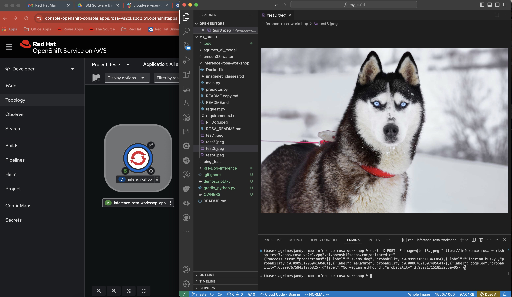

# inference-rosa-workshop
# This is a workshop for deploying a Pytorch & FastAPI project to ROSA on AWS and perform inference.
by Andrew Grimes and Jim Garrett of Red Hat 

If you need a ROSA cluster, you can use this program to get a free ROSA Cluster Trial 
https://www.redhat.com/en/blog/introducing-red-hat-openshift-service-aws-hands-experience

Containerized app that serves a containerized Resnet18 deep learning image classification model using FastAPI. We used an ImageNet pretrained model that can predict 1000 different classes of general objects, the samples are animals but it will work with anything. See class list [here](https://deeplearning.cms.waikato.ac.nz/user-guide/class-maps/IMAGENET/).

Forked from this project for a workshop: https://github.com/hasibzunair/imagercg-waiter
ResNet18 https://www.mathworks.com/help/deeplearning/ref/resnet18.html

A second option is to add a Gradio web front end to this probject. Here is the git repo for the web front end option. 
https://github.com/emcon33/inference-rosa-frontend

Sample Backend App and Input Image: 

    
  <em> 
  </em>

Sample Text Output:
{"success":true,"predictions":[{"label":"black-and-tan coonhound","probability":0.5641617774963379},{"label":"Doberman","probability":0.3869141638278961},{"label":"bluetick","probability":0.012455757707357407},{"label":"Rottweiler","probability":0.007904204539954662},{"label":"Gordon setter","probability":0.006333122029900551}]}%

OpenShift/ROSA instructions (deck to be created) 
1. Bring up a generic ROSA cluster in AWS. This also works with OpenShift or other Managed OpenShift Options to demonstrate portability.

2. Create a Project and use the Git build option taking the defaults. watch the build logs until complete to see how ROSA builds. 
  This Repo: https://github.com/emcon33/inference-rosa-workshop

3. Obtain your URL for the web front end from the image via topology map, it should open to a place holder page. 

4. From local system use a test1.image with your URL updated to this command and "curl" your image to the API front end.
curl -X POST -F image=@test3.jpeg "https://inference-rosa-workshop-test7.apps.rosa-vs2cl.zpq2.p1.openshiftapps.com/api/predict"

5. Additional test images are available on the source git repo or use your own, it works with animals and objects. 

Optional front end to this project. Here is the git repo just follow the instructions to fork and modify the URL from this deployed repo.  
https://github.com/emcon33/inference-rosa-frontend

### References
Original source https://towardsai.net/p/machine-learning/build-and-deploy-custom-docker-images-for-object-recognition
Forked from this github https://github.com/hasibzunair/imagercg-waiter

`
